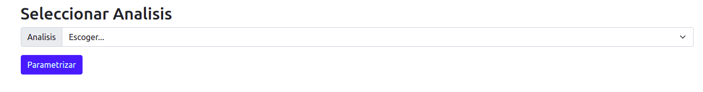
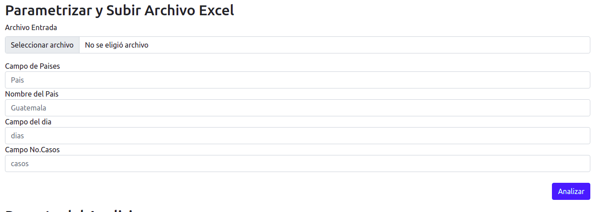
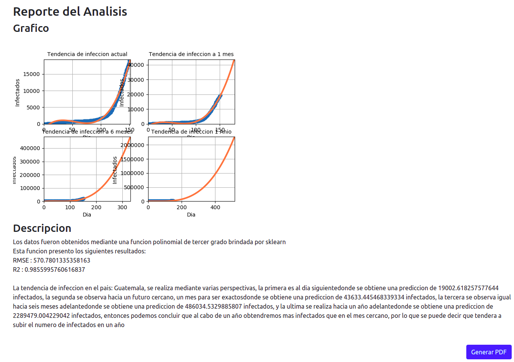
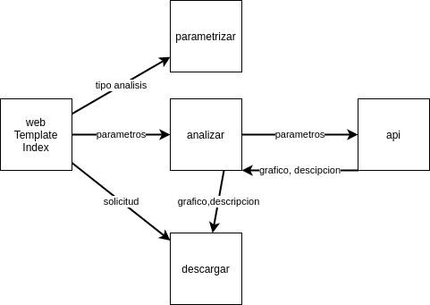

# Proyecto2Compi2Vac

## Integrantes
William Rodrigo Umaña de León - 201931448

# Manual de Usuario

La instalacion de esta herramienta es bastante sencilla aunque debe tener en cuenta los siguientes requerimientos.

- Python recomendable mayor a 3.8 
- Django
- matplotlib
- scikit-learn
- numpy
- reportlab
- pandas

Y si deseas correr el proyecto con gunicorn nunca esta de mas.

Cabe mencionar que para la instalacion de algunos requisitos es necesario tener pip instalado, si en dado caso no se tiene se puede instalar python primero y luego ingresar el siguiente comando.
```bash
 apt install python3-pip
```

La instalacion de cada uno de estos requisitos es la siguiente:

Para la instalacion de Django se utiliza el siguiente comando 
```bash
python -m pip install Django
```

Para la instalacion de matplotlib se utiliza el siguiente comando 
```bash
python -m pip install -U matplotlib
```
Para la instalacion de scikit-learn se utiliza el siguiente comando 
```bash
python -m pip install -U scikit-learn
```

Para la instalacion de numpy se utiliza el siguiente comando 
```bash
python -m pip install -U numpy
```

Para la instalacion de reportlab se utiliza el siguiente comando 
```bash
python -m pip install -U reportlab
```


## Usabilidad
La manera de usar el programa es bastante sencillo, y se explica en pocas palabras.

Primero vera en la web un espacio donde podrá seleccionar el análisis que desea realizar.



Luego de la selección el programa validara la selección y le mostrara distintos parámetros que deberá llenar, así como también un espacio en donde puede subir un archivo de excel o un csv. Ya que esto permite al programa leer los datos dentro y analizarlos.




Luego de haber ingresado los datos, deberá presionar el botón de analizar quien permitirá enviar los parámetros junto con el archivo y así podrá analizar los datos.




Luego de presionar el botón de analizar deberá aparecer un gráfico y una pequeña descripción sobre que significan los datos. Ademas puede descargar ese gráfico con su descripción en un pdf presionando el botón de Generar PDF.

# Manual Técnico

La instalación de esta herramienta es bastante sencilla aunque debe tener en cuenta los siguientes requerimientos,se describe el requerimiento con la versión que se utilizo para el desarrollo.

- Python recomendable mayor a 3.8 
- Django 4.0
- matplotlib 3.1.2
- scikit-learn 1.0.1
- numpy 1.21.5
- reportlab 3.5.34
- pandas 1.3.5

La descripción de la instalación de cada uno de los requerimientos se encuentra en el manual de usuario.

Como gráfico descriptivo de la aplicación tenemos el siguiente.



Que explica de manera general como es que la aplicación esta trabajando.
La descripción mas completa de este gráfico es la siguiente: primero se inserta el tipo de análisis que se requiere utilizar, para luego este ser enviado a un view que tiene la aplicación y validar el tipo de análisis, y de esa manera ser devuelto y que la misma pagina se encargue de poner los espacios que son requeridos para el análisis correspondiente, luego de eso ya se envían los parámetros y lo recibe otra view que valida el tipo de análisis que se requiere para luego enviarlo a la api y así generar el gráfico y la descripción. Y por ultimo se tiene el botón de generar pdf que lo que hace es traer la ultima información enviada que se guardo en un espacio global y de esta manera saber que es lo que tiene que escribir y dibujar para luego enviar únicamente el pdf a descargar